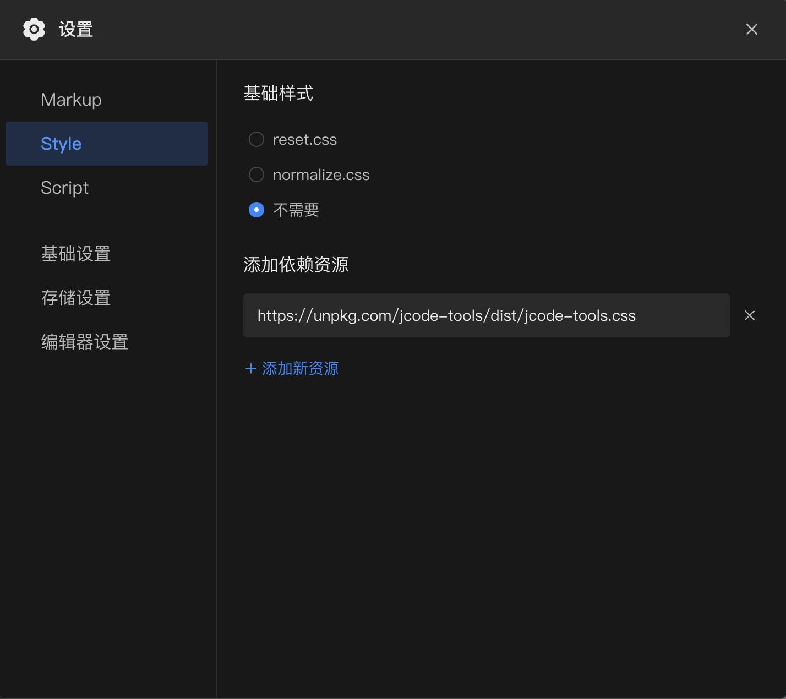

# JCode Tools

## 简介

这是为[码上掘金](https://code.juejin.cn/)提供的JS工具库，用它来增强码上掘金的能力和弥补它的不足。

## API

### 1. JCode.getCustomCode

在[自定义Script模式](https://juejin.cn/post/7118935790192721957)下，获得代码文本。

```js
const code = await JCode.getCustomCode(); 
```

### 2. JCode.logger

将控制台内容输出到页面上。

```js
const logger = JCode.logger(container);
logger.log('Hello %cworld', 'color:red');
```

### 3. JCode.CodeXClient

运行服务端代码。

支持同步和异步模式。

#### 同步模式：[在线demo](https://code.juejin.cn/pen/7122291068397322248)

```html
<script type="module">
import {CodeXClient, logger} from 'https://cdn.jsdelivr.net/npm/jcode-tools/dist/jcode-tools.esm.js';
(async () => {
  window.console = logger(app);
  console.log('提交代码，请稍候');

  try {
    const code = new CodeXClient(); // 默认会从CustomCode中获取
    const result = await code.runCode({input: ['1 1']});
    if(result.error) {
      console.error(result.error);
    }
    console.log(result.output);
  } catch(ex) {
    console.error(ex);
  }
})();
</script>
```

#### 异步模式：[在线demo](https://code.juejin.cn/pen/7121977600011927589)

```html
<script type="module">
import {CodeXClient, logger} from 'https://cdn.jsdelivr.net/npm/jcode-tools/dist/jcode-tools.esm.js';
(async () => {
  window.console = logger(app);
  console.log('提交代码，请稍候');

  try {
    const code = new CodeXClient();
    code.onmessage = (msg) => {
      console.log(msg);
    }
    code.onerror = (msg) => {
      console.error(msg);
    }

    const result = await Promise.all(
      [code.runCode()
      , code.input('1 1')
      , code.input('2 3')
      , code.input('')]);
    if(result[0].error) {
      console.error(result[0].error);
    }
  } catch(ex) {
    console.error(ex);
  }
})();
</script>
```

### 4. KV存储服务

提供简单的KV存储，可以存储一些数据到服务器。

```js
import {Storage} from 'https://cdn.jsdelivr.net/npm/jcode-tools/dist/jcode-tools.esm.js';

const storage = new Storage();
const successful = await storage.set('juejin', {id: 'value'});
if(successful) {
  const data = await storage.get('juejin');
  console.log(data); // {id: 'value'}
  await storage.del('juejin');
} else {
  console.error(storage.result.error);
}
```

## 使用方式

1. 可以直接通过 CDN 引入 `https://cdn.jsdelivr.net/npm/jcode-tools` 以及对应的 css `https://cdn.jsdelivr.net/npm/jcode-tools/dist/jcode-tools.css`;




2. 可以通过 ESModule 引入：

```js
import {CodeXClient, logger} from 'https://cdn.jsdelivr.net/npm/jcode-tools/dist/jcode-tools.esm.js';
```

## JCode精选

http://www.jcode.pub/

在 Docs 文件夹下收录 JCode 精选代码。

添加自己的代码合辑到 JCode 精选，只需要编辑 `./collections/<your_collection_name>.docrc.js` 文件，然后提交 PR 即可。

通过 `http://www.jcode.pub/?<your_collection_name>` 进行访问。

## 如何贡献代码

Clone 本项目，`npm install` 安装依赖，然后运行 `npm run dev`。

设置 `http://localhost:8000/dist/jcode-tools.js` 到码上掘金项目的依赖资源中即可调试运行。
