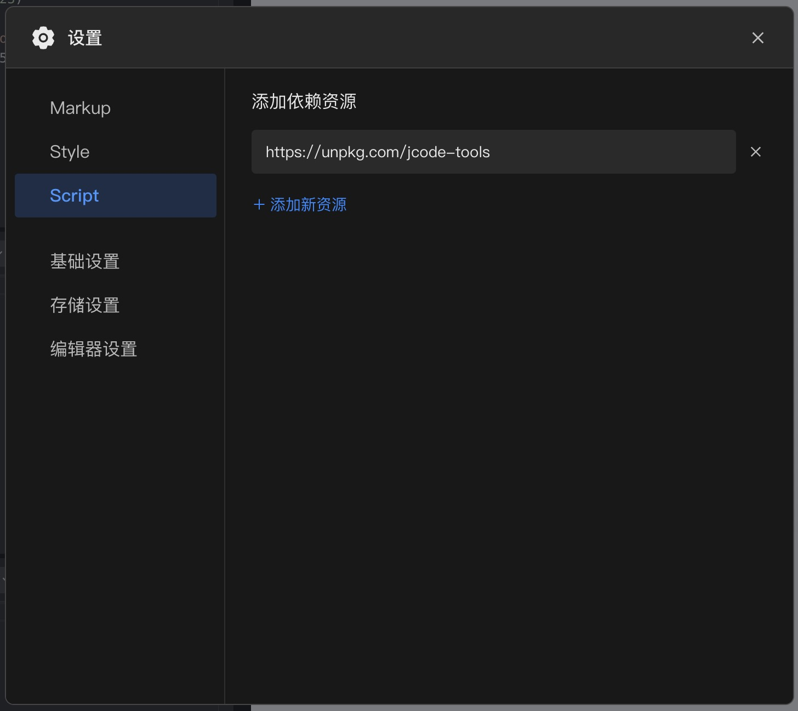

# JCode Tools

## 简介

这是为[码上掘金](https://code.juejin.cn/)提供的JS工具库，用它来增强码上掘金的能力和弥补它的不足。

## API

### 1. JCode.getCustomCode

在自定义Script模式下，获得代码文本。

```js
const code = await JCode.getCustomCode(); 
```

## 使用方式

可以直接通过 CDN 引入 `https://unpkg.com/jcode-tools`



## JCode精选

http://www.jcode.pub/

在 Docs 文件夹下收录 JCode 精选代码。

添加自己的代码合辑到 JCode 精选，只需要编辑 `./collections/<your_collection_name>.docrc.js` 文件，然后提交 PR 即可。

通过 `http://www.jcode.pub/?<your_collection_name>` 进行访问。

## 如何贡献代码

Clone 本项目，`npm install` 安装依赖，然后运行 `npm run dev`。

设置 `http://localhost:8000/dist/jcode-tools.js` 到码上掘金项目的依赖资源中即可调试运行。
